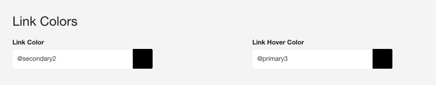

Determines the colours used as variables across the theme as well as basic colour settings for background, border, text and headings.

**Colors**

 
**LESS Variables**

	@primary:					#2980B9; // Can be re-used in other colour settings in the template
	@secondary:					#2C3E50; // Can be reused in other colour settings in the template
	@body-bg:					#fff; // Applies to the html, body and Zen-wrap divs in the template
	@bordercolor:				#eee; // Used as the base colour for borders in the template
	@text-color:				#333; // Color applied to all text elements that are not headings or otherwise specified in other settings
	@headings-color:          	#999; // Can also use @heading-color
	
## Primary and Secondary colours

The primary and secondary colours are variables that are created based on the colours you assign to @primary and @secondary values. The template takes them and makes them 15% darker (@primary2 and @secondary2) or 15% lighter (@primary3 and @secondary3). This makes it possible to automatically spin new colours based on your @primary and @secondary variables and use them in your template, as in the screenshot below.

**LESS Variables**

	// Primary colours
	@primary2:				darken(@primary, 15%);
	@primary3:				lighten(@primary, 15%);
	
	
	// Secondary colours
	@secondary2:			darken(@secondary, 15%);
	@secondary3:			lighten(@secondary, 15%);

