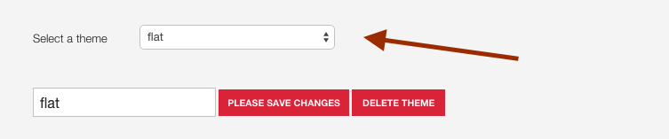
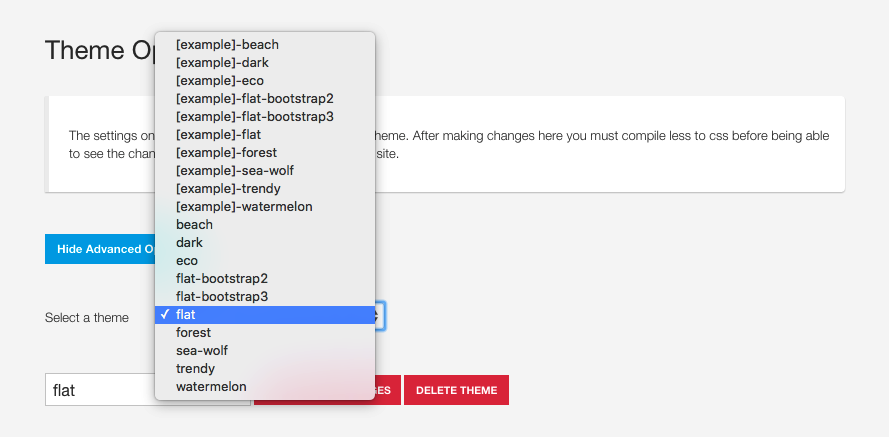
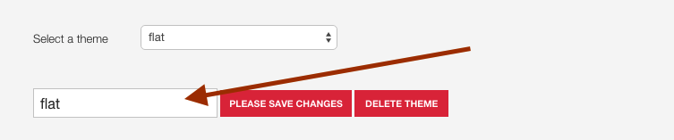

Themes are built using less files to generate .css files that are ultimately loaded in the browser by the template. 

## What is LESS?
If you are unfamiliar with Less, it's essentially a shortcut language for generating css files. Less (as well as other preprocessor languages) allow for the use of variables to be used as a way to reduce the specificity of your code. For more information regarding the LESS language please check out the <a target="_blank" href="http://lesscss.org">LESS documentation</a>.

## Where are theme variables stored?
The theme variables are stored in json files in the settings/themes folder. The variables populate the administrator panel when a theme is loaded and are then passed to the less compiler when you press the compile less button or save your theme in the theme panel.

Whenever a json file is added to this folder it will automatically appear in the theme list in the template admin.

**Available themes can be found in the theme dropdown**

**Current theme is highlighted in the text input under the theme dropdown.**

**Example theme content**

	{
		"twidth":"1140px",
		"gutter":"30px",
		"gutter-pc":"4%",
		"backgroundtexture":"inherit",
		"body-bg":"F1EFF0",
		"primary":"91AA9D",
		"secondary":"D1DBBD",
		"border-color":"E1E1E1",
		"text-color":"0c2436",
		"heading-color":"010c14",
		"link-color":"000000",
		"link-hover-color":"@secondary",
		"top-link-color":"333",
		"top-link-hover-color":"@secondary",
		"footer-link-color":"333",
		"footer-link-hover-color":"@secondary",
		"btn-primary-color":"333333",
		"btn-primary-color-hover":"ffffff",
		"btn-primary-bg":"none",
		"btn-primary-bg-hover":"@secondary",
		"btn-primary-border":"@border-color",
		"btn-primary-border-hover":"@secondary",
		"navbar-default-bg":"ffffff",
		"navbar-default-link-color":"333",
		"navbar-default-link-hover-color":"@primary",
		"navbar-default-link-active-color":"@primary",
		"navbar-default-link-hover-active-bg":"none",
		"navbar-default-link-hover-active-color":"@primary",
		"navbar-default-link-active-bg":"none",
		"navbar-text-color":"@primary",
		"dropdown-bg":"@primary",
		"dropdown-link-color":"eee",
		"dropdown-link-active-color":"fff",
		"dropdown-link-hover-color":"333",
		"dropdown-header-color":"@dropdown-link-color",
		"logo-color":"333333",
		"logo-hover-color":"@secondary",
		"off-canvas-bg":"54595D",
		"off-canvas-header":"ffffff",
		"off-canvas-text-color":"ffffff",
		"off-canvas-link-color":"eeeeee",
		"overlay-transparency":"0.9",
		"overlay-bg":"333",
		"zen-panel-bg":"ffffff",
		"zen-panel-color":"333333",
		"zen-panel-link-color":"999999",
		"input-min-height":"42px",
		"input-bg":"ffffff",
		"input-border":"@border-color",
		"input-color":"@text-color",
		"pagination-bg":"none",
		"pagination-border":"999999",
		"pagination-color":"999999",
		"top_row_style":"",
		"banner_row_style":"",
		"grid1_row_style":"",
		"grid2_row_style":"",
		"grid3_row_style":"",
		"grid4_row_style":"",
		"grid5_row_style":"secondary-row",
		"grid6_row_style":"",
		"bottom_row_style":"primary-row",
		"footer_row_style":"",
		"social-icon-color":"ffffff",
		"social-icon-hover-color":"ffffff",
		"social-icon-font-size":"1em",
		"font_awesome_type":"all",
		"framework_enable":"0",
		"framework_files_group":"",
		"framework_version":"bootstrap2",
		"font-size-base":"14px",
		"line-height-base":"1.4em",
		"body-font-weight":"300",
		"headings-font-weight":"300",
		"navfontweight":"600",
		"logo-font-weight":"900",
		"logo-font-size":"2.5em",
		"logo-line-height":"1.5em",
		"tablet-max-width":"700px",
		"phone-max-width":"620px",
		"gridcollapse":"1060px",
		"navcollapse":"1060px",
		"container-width":"80%",
		"tablet-container-width":" 80%",
		"phone-container-width":"80%",
		"dropdown_min_width":"300px",
		"menu-animation":"0.4s",
		"enable_animations":"1",
		"top_animation":"rotateIn",
		"header_animation":"none",
		"banner_animation":"none",
		"grid1_animation":"none",
		"grid2_animation":"fadeInRightBig",
		"grid3_animation":"fadeInLeftBig",
		"main_animation":"none",
		"grid4_animation":"fadeInDownBig",
		"grid5_animation":"fadeInUpBig",
		"grid6_animation":"none",
		"bottom_animation":"none",
		"footer_animation":"none",
		"social-top-offset":"220px",
		"compresscss":"0",
		"add_to_compiler":"",
		"framework_version": "bootstrap2",
		"framework_files":""
	}

## How do these variables get turned into CSS?
In order to save any changes to your theme's less values whether they are via the template administrator or you make the changes manually, it is necessary to compile less to css. 

Please note that when using the template interface when any When any change setting that requires less to be compiled the theme will automatically do this when the template is saved using the standard Joomla save button.

The framework compiler will then retrieve the variables stored in your theme file and parse them through the template's less files and render css that can be used by your template.

