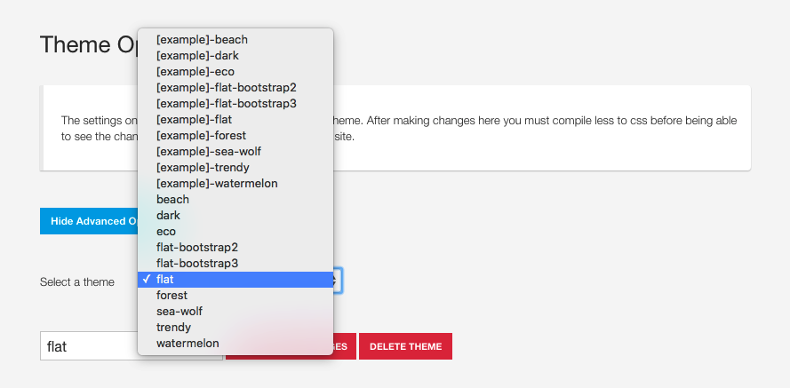

A template's preset files are essentially the same as the templates theme files just stored in the following folder:

	yoursite.com/templates/[your zgf4 template]/settings/themes/presets

**Presets use the following naming convention to highlight the fact that they are examples.**

	theme.[example]-blank.json
	
**Preset files are automatically merged into the theme dropdown  list.**

**The contents of a preset file are the same as the content in theme files.**

	{
		"twidth":"1140px",
		"gutter":"30px",
		"gutter-pc":"4%",
		"backgroundtexture":"inherit",
		"body-bg":"F1EFF0",
		"primary":"91AA9D",
		"secondary":"D1DBBD",
		"border-color":"E1E1E1",
		"text-color":"0c2436",
		"heading-color":"010c14",
		"link-color":"000000",
		"link-hover-color":"@secondary",
		"top-link-color":"333",
		"top-link-hover-color":"@secondary",
		"footer-link-color":"333",
		"footer-link-hover-color":"@secondary",
		"btn-primary-color":"333333",
		"btn-primary-color-hover":"ffffff",
		"btn-primary-bg":"none",
		"btn-primary-bg-hover":"@secondary",
		"btn-primary-border":"@border-color",
		"btn-primary-border-hover":"@secondary",
		"navbar-default-bg":"ffffff",
		"navbar-default-link-color":"333",
		"navbar-default-link-hover-color":"@primary",
		"navbar-default-link-active-color":"@primary",
		"navbar-default-link-hover-active-bg":"none",
		"navbar-default-link-hover-active-color":"@primary",
		"navbar-default-link-active-bg":"none",
		"navbar-text-color":"@primary",
		"dropdown-bg":"@primary",
		"dropdown-link-color":"eee",
		"dropdown-link-active-color":"fff",
		"dropdown-link-hover-color":"333",
		"dropdown-header-color":"@dropdown-link-color",
		"logo-color":"333333",
		"logo-hover-color":"@secondary",
		"off-canvas-bg":"54595D",
		"off-canvas-header":"ffffff",
		"off-canvas-text-color":"ffffff",
		"off-canvas-link-color":"eeeeee",
		"overlay-transparency":"0.9",
		"overlay-bg":"333",
		"zen-panel-bg":"ffffff",
		"zen-panel-color":"333333",
		"zen-panel-link-color":"999999",
		"input-min-height":"42px",
		"input-bg":"ffffff",
		"input-border":"@border-color",
		"input-color":"@text-color",
		"pagination-bg":"none",
		"pagination-border":"999999",
		"pagination-color":"999999",
		"top_row_style":"",
		"banner_row_style":"",
		"grid1_row_style":"",
		"grid2_row_style":"",
		"grid3_row_style":"",
		"grid4_row_style":"",
		"grid5_row_style":"secondary-row",
		"grid6_row_style":"",
		"bottom_row_style":"primary-row",
		"footer_row_style":"",
		"social-icon-color":"ffffff",
		"social-icon-hover-color":"ffffff",
		"social-icon-font-size":"1em",
		"font_awesome_type":"all",
		"framework_enable":"0",
		"framework_files_group":"",
		"framework_version":"bootstrap2",
		"font-size-base":"14px",
		"line-height-base":"1.4em",
		"body-font-weight":"300",
		"headings-font-weight":"300",
		"navfontweight":"600",
		"logo-font-weight":"900",
		"logo-font-size":"2.5em",
		"logo-line-height":"1.5em",
		"tablet-max-width":"700px",
		"phone-max-width":"620px",
		"gridcollapse":"1060px",
		"navcollapse":"1060px",
		"container-width":"80%",
		"tablet-container-width":" 80%",
		"phone-container-width":"80%",
		"dropdown_min_width":"300px",
		"menu-animation":"0.4s",
		"enable_animations":"1",
		"top_animation":"rotateIn",
		"header_animation":"none",
		"banner_animation":"none",
		"grid1_animation":"none",
		"grid2_animation":"fadeInRightBig",
		"grid3_animation":"fadeInLeftBig",
		"main_animation":"none",
		"grid4_animation":"fadeInDownBig",
		"grid5_animation":"fadeInUpBig",
		"grid6_animation":"none",
		"bottom_animation":"none",
		"footer_animation":"none",
		"social-top-offset":"220px",
		"compresscss":"0",
		"add_to_compiler":"",
		"framework_version": "bootstrap2",
		"framework_files":""
	}